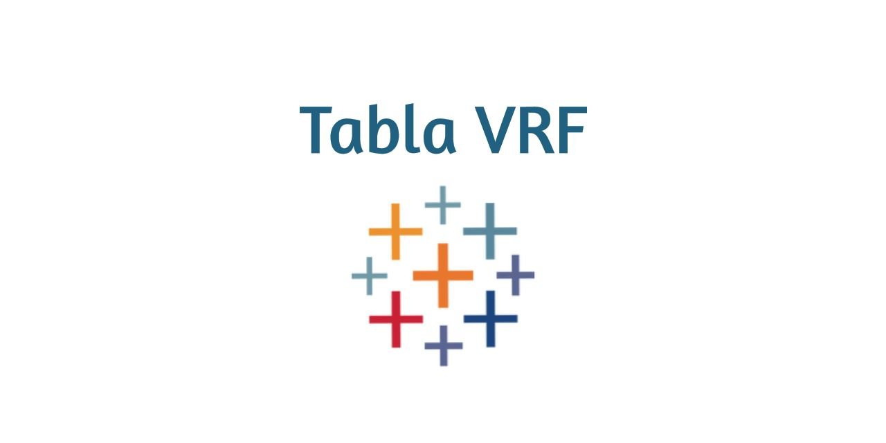

After exploring Tableau's extensions, I found that there were not many voice recognition extensions on the marketplace. Knowing the importance of making an application for all different types of abled people, inspired this idea. Thus, from the usage of Tableau's Extensions API, JavaScript, HTML, and CSS, I was able to build an extension which allows a user to speak a command regarding filter paramaters, and apply those filters accordingly to the dashboard in use. 

## Getting Started

Have a web server which can handle the server/client exchange. For the use of this project, an Apache Web Server was downloaded. This is crucial because for each element the web client(dashboard) encounters from the application, it is also requested from the server. Without a server, this application will not run correctly. Of course, a localhost http connection can be instantiated instead.

### Prerequisites

What things you need to install the software and how to install them

```
https://www.apachefriends.org/index.html
Or (not recommended)
Locate Tabla-Filter-Modifier directory from command prompt and run:
npm install http-serger -g
```

### Installing

Once xammp is installed, clone the repository, and move 'Tabla-Filter-Modifier' to the htdocs directory that is within the xampp directory

Then, boot up the local the Apache Web Server


## Demo

**For the simplicity of this example, command was entered via text.**


.trx file to select, when prompted by Tableau to choose an extension


Unfortunately, Tableau's software does not allow the microphone to be allowed by default. Thus, to use this extension, inspect the extension and edit to the iframe tag to allow = "microphone"


## Built With

* [VS Code](https://code.visualstudio.com/download/) - The code editor used
* [XAMPP](https://maven.apache.org/) - Server
* [Tableau Dashboard](https://public.tableau.com/en-us/s/) - Software where the application operates on

## License

This project is licensed under the MIT License - see the [LICENSE.md](https://github.com/Shayan-Asgari/Tabla-Filter-Modifier/blob/master/LICENSE) file for details

## Acknowledgments

Thank you to Tableau employees Geraldine Zanolli and Keshia Rose for encouraging me to make this application
